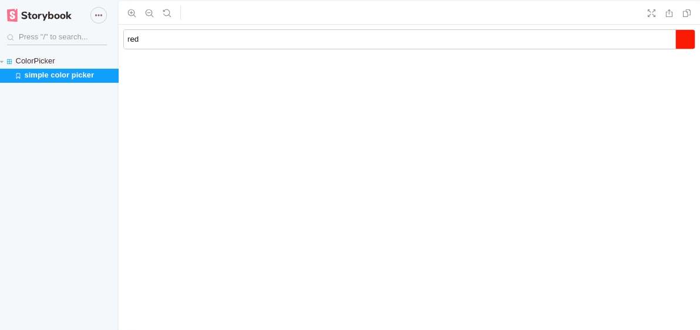

# React Color Picker

[](https://www.npmjs.com/package/@fiveem/react-color-picker)

## Screenshots




## Install

```
npm i @fiveem/react-color-picker
```

## Usage

```JSX
import ColorPicker from '@fiveem/react-color-picker'

<ColorPicker    value={this.state.value}
                name={this.state.name}
                colors={this.colors}
                onChange={this.onChange} />
```

## API
|name|type|default value|description|
|----|----|-------------|-----------|
|value|String (Required)||Input value|
|name|String|`color`|Name of the input|
|colors|Array|[`#1abc9c`,`#16a085`,`#2ecc71`,`#27ae60`,`#4caf50`,`#8bc34a`,`#cddc39`,`#3498db`,`#2980b9`, `#34495e`,`#2c3e50`,`#2196f3`,`#03a9f4`,`#00bcd4`,`#009688`,`#e74c3c`,`#c0392b`,`#f44336`, `#e67e22`,`#d35400`,`#f39c12`,`#ff9800`,`#ff5722`,`#ffc107`,`#f1c40f`,`#ffeb3b`,`#9b59b6`, `#8e44ad`,`#9c27b0`,`#673ab7`,`#e91e63`,`#3f51b5`,`#795548`,`#9e9e9e`,`#607d8b`,`#333333`, `#7f8c8d`,`#95a5a6`,`#bdc3c7`,`#ecf0f1`,`#efefef`,`#fcfcfc`]|Colors that will be displayed in the color picker|
|onChange|Function (Required)||Function that is called when the input changes|

## License

react-color-picker is released under the MIT license.
